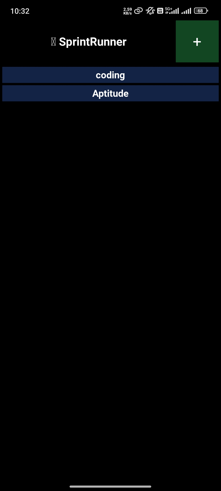
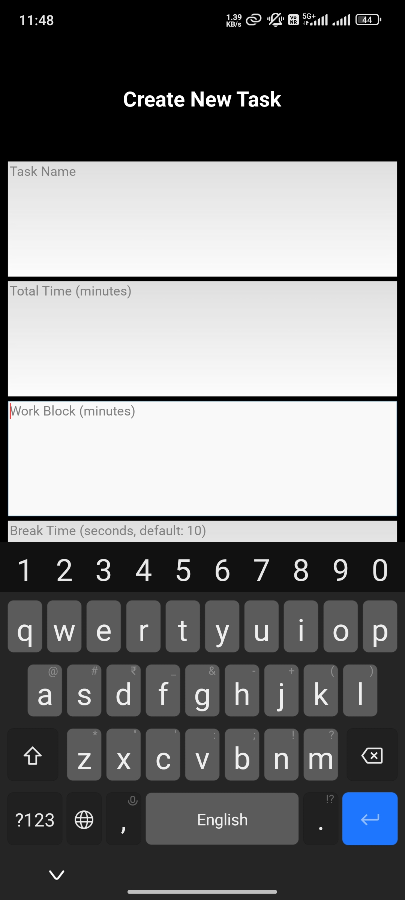
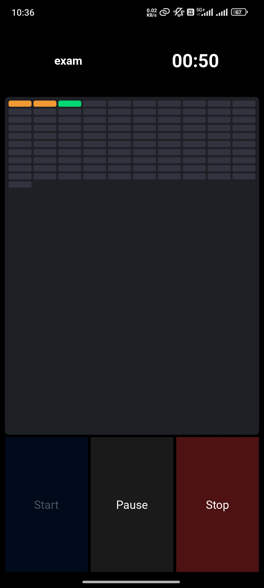

# 🏃 SprintRunner

Sprint Runner is a Python-based productivity timer app that helps you structure focused work sessions using customizable time blocks and breaks.

---

## 📱 App Status: Live & Functional
The core engine and UI have been successfully compiled into a standalone Android APK. 
* **Backend:** Object-Oriented Python (`Task`, `Schedule`, `Timer` modules)
* **Frontend:** Kivy GUI Framework
* **Build System:** Buildozer / GitHub Actions (CI/CD)

## 📱 Screenshots

<p align="center">
  
  
  
  
</p>

## ✨ Features

- ✅ **Customizable Time Blocks** - Set your own work duration (e.g., 5 min per coding problem)
- ✅ **Smart Break System** - Automatic breaks between work blocks (e.g., 10 sec rest)
- ✅ **Reusable Templates** - Save timer configurations and reuse them daily
- ✅ **Visual Progress** - Modern pill-shaped progress bars show completed/active/pending blocks
- ✅ **Dual Alarm Tones** - Different sounds for work vs break blocks
- ✅ **Task Management** - Create, save, and delete custom timers
- ✅ **Long-press Delete** - Hold task cards to delete them

## 🎯 Use Case Example

**Coding Practice Session:**
- Total time: 60 minutes
- Work block: 5 minutes per problem
- Break: 10 seconds between problems
- Result: 10 focused coding sprints with automatic breaks

**Other Use Cases:**
- Exam preparation with timed question-solving
- Exercise routines with rest intervals
- Reading sessions with periodic breaks
- Any task requiring structured time management

## 🛠️ Tech Stack

- **Language:** Python 3.10+
- **GUI Framework:** Kivy 2.2.1
- **Data Storage:** JSON (for timer configurations)
- **Audio:** Kivy SoundLoader
- **Architecture:** Object-Oriented Programming (OOP)

**Dependencies:**
- kivy==2.2.1

### Core OOP Classes:
- `Task` - Timer configuration
- `Schedule` - Generates work/break blocks
- `Timer` - Countdown logic
- `TimerRepository` - Save/load functionality
- `HomeScreen`, `CreateTaskScreen`, `TimerScreen` - UI screens

## 📲 Installation

### Android APK
Download the latest APK from [Releases](https://github.com/Sasi0026/SprintRunner/releases)

### Build from Source

**Prerequisites:**
- Python 3.10+
- Git
- kivy

**Steps:**
```bash
# Clone repository
git clone https://github.com/Sasi0026/SprintRunner.git
cd SprintRunner

# Install dependencies
pip install -r requirements.txt

# Run locally
python main.py
```

### Build Android APK with GitHub Actions

1. Fork this repository
2. Push changes to `main` branch
3. Go to Actions tab → Build Android APK
4. Download APK from Artifacts

## 🚀 Roadmap

Sprint Runner is actively developed. Upcoming versions will introduce AI agent features:

### Planned Features

- [ ] **Background Service** - Timer continues when app is minimized or screen is off
- [ ] **Enhanced UI** - Display session stats (blocks completed, remaining time)
- [ ] **Statistics Dashboard** - Track productivity over time
- [ ] **Notification Support** - Show timer updates in notification bar
- [ ] **Dark/Light Themes** - Customizable color schemes
- [ ] **Export/Import** - Share timer configs with others
- [ ] **Voice Command Support** - Control sprints and timers hands-free using voice input

### 🤖 AI Agent Features

#### AI Scheduling Agent
- Natural language task input ("Schedule a 2-hour deep work sprint tomorrow morning")
- Intelligent sprint planning based on task priority and deadlines

#### Timer & Break Agent
- Adaptive break suggestions based on your work patterns
- Auto-timer management without manual input

#### Work Organisation Agent
- Smart task grouping and categorisation
- Daily/weekly summary reports

> AI agent features are being built using Python-based LLM orchestration (exploring CrewAI, LangChain).

## 📸 Current Features

**Home Screen:**
- View all saved timers
- Tap `+` to create new timer
- Long-press task cards to delete

**Create Task Screen:**
- Task name
- Total duration (minutes)
- Work block duration (minutes)
- Break duration (seconds, default: 10)

**Timer Screen:**
- Real-time countdown
- Visual progress bars (orange = completed, green = active, gray = pending)
- Start/Pause/Resume/Stop controls

## 🤝 Contributing

Contributions are welcome! Please feel free to submit a Pull Request.

## 📝 License

This project is licensed under the MIT License - see the [LICENSE](LICENSE) file for details.

## 👨‍💻 Author

**Sasi0026**
- GitHub: [@Sasi0026](https://github.com/Sasi0026)

## Acknowledgments

- Built as a learning project to master OOP in Python
- Inspired by Pomodoro Technique and focus timer apps

---

**Status:** ✅ Functional MVP | 🚧 Active Development


